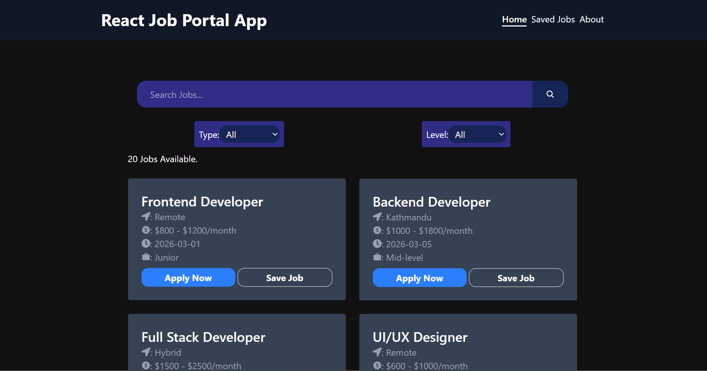

# 🧑‍💼 React Job Portal App

A modern and responsive **React Job Portal Application** that allows users to search, filter, save, and view job listings with a clean and intuitive user interface.

This project demonstrates real-world frontend development concepts such as **state management, dynamic filtering, routing, pagination, and persistent storage**, making it a strong portfolio project for aspiring frontend developers.

---

## 🚀 Live Demo  
Check out the live version here:  
**(https://rohitshahreactjobportalapp.netlify.app/)**

---

## 📸 Preview  



---

## 🛠️ Features

- 🔍 Search jobs by title or keyword  
- 🎯 Filter jobs by **type** and **experience level**  
- 💾 Save jobs to view later  
- 📄 View detailed job information  
- 📑 Pagination for better user experience  
- 🔗 Dynamic routing for job detail pages  
- 📱 Fully responsive design  
- ⚡ Fast performance with Vite  
- 🎨 Clean UI built using Tailwind CSS  

---

## ⚙️ Tech Stack

- **React JS**
- **Vite**
- **Tailwind CSS**
- **React Router**
- **Context API**
- **JavaScript (ES6+)**
- **LocalStorage**
- **Component-Based Architecture**

---

---

## 🧠 Key Concepts Demonstrated

- State Management using **Context API**
- Dynamic Filtering and Searching
- Conditional Rendering
- Pagination Logic
- Reusable Components
- Client-Side Routing
- Persistent Data with **LocalStorage**
- Responsive UI Design

---

## 📦 Installation

Clone the repository and install dependencies.

```bash
git clone https://github.com/yourusername/react-job-portal-app.git
cd react-job-portal-app
npm install
